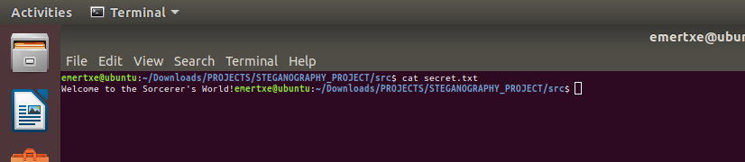
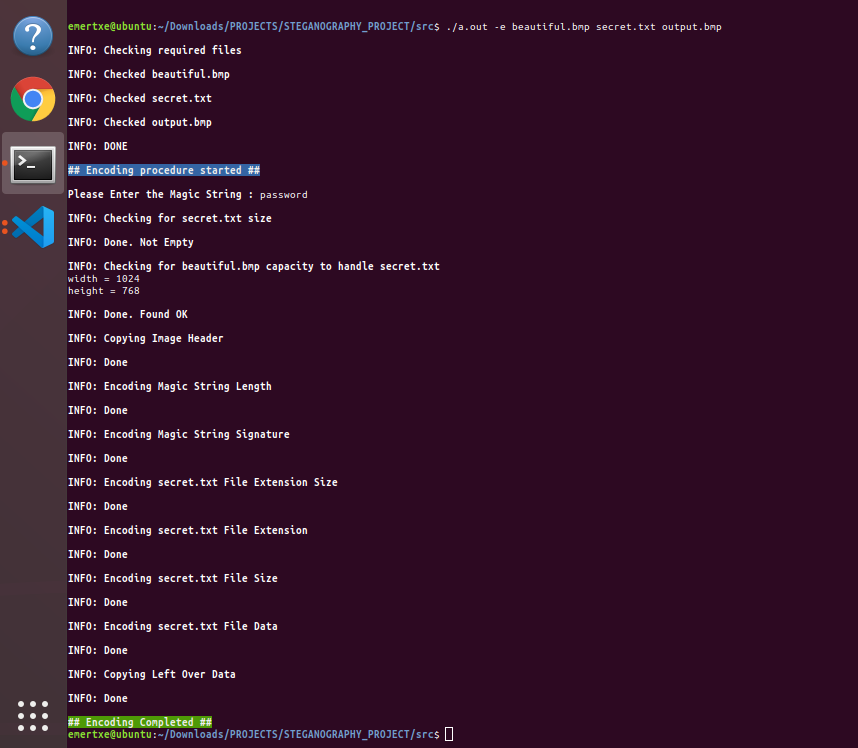
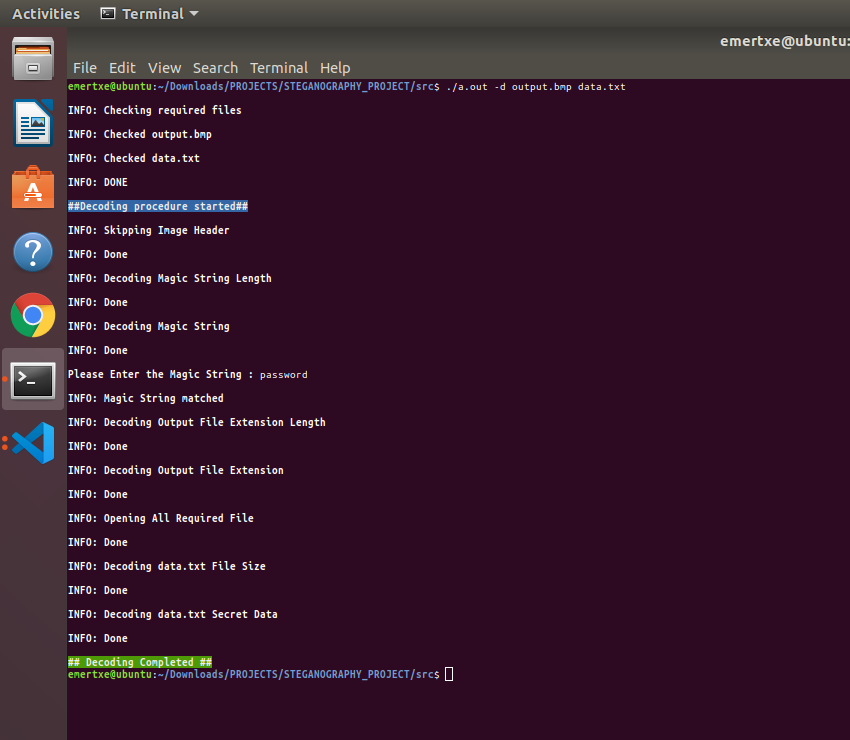
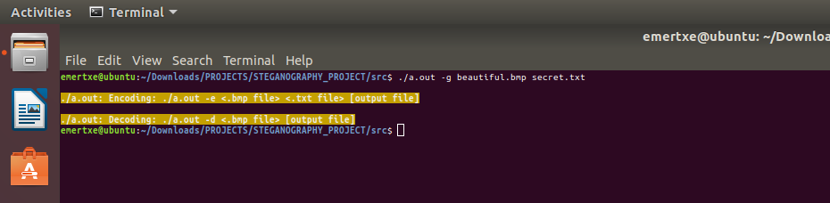

## Arbitrary Precision Calculator (APC)

## Overview

    This project implements steganography, the art of hiding secret data within an image file. Specifically, the project encodes and decodes hidden information using the Least Significant Bit (LSB) technique in BMP image files. The tool provides a simple, efficient way to embed data without altering the visual quality of the image.

## Features

    Encoding: Hides secret data within the LSBs of BMP image pixels.

    Decoding: Extracts the hidden data from an encoded BMP image.

    File Validation: Ensures proper handling of BMP files.

    Customizable Output: Allows users to specify output file names.

## Why BMP Files?

    BMP files are uncompressed image formats that store raw pixel data. This makes them ideal for steganography because:

    They lack compression artifacts, allowing precise manipulation of pixel values.

    The file structure is straightforward and easy to work with.

    BMP Expansion: Bitmap Image File.

## Technologies Used

    Programming Language: C

    File Handling: For reading/writing BMP and text files.

    Bitwise Operations: For encoding and decoding data at the bit level.

## Installation

    Clone the Repository:

        git clone <repository-url>
        cd <repository-folder>

    Compile the Code on windows machine:
        Use the GCC compiler to compile the source files:

        gcc -o encode encode.c decode.c test_encode.c beautiful.bmp secret.txt common.h decode.h encode.h types.h -lm
        gcc -o decode encode.c decode.c test_encode.c beautiful.bmp secret.txt common.h decode.h encode.h types.h -lm

    Run the program on windows machine:
    
        Encoding Data:

            ./encode -e <source_image.bmp> <secret.txt> <output_image.bmp>

        Decoding Data:

            ./decode -d <encoded_image.bmp> <output.txt>

    Compile the Code on linux machine:

        gcc *.c

    Run the program on windows machine:
    
        Encoding Data:

            ./a.out -e <source_image.bmp> <secret.txt> <output_image.bmp>

        Decoding Data:

            ./a.out -d <encoded_image.bmp> <output.txt>

    Command Line Arguments:

        <source_image.bmp>: The BMP file where data will be hidden.

        <secret.txt>: The text file containing the secret data.

        <output_image.bmp>: The BMP file with the encoded data.

        <encoded_image.bmp>: The BMP file with hidden data.

        <output.txt>: The file to store the extracted data.

## Screenshots
Source Image:

Secret Data:

Encoding:

Output Image:

Decoding:

Decoded Data:

Invalid input:

## File Structure

    test_encode.c: Main program file containing function calls of encoding and decoding process.

    encode.c: Contains the logic for embedding secret data into the BMP image.

    decode.c: Handles the extraction of hidden data from the BMP image.

    common.h & types.h: Shared constants and utility functions.

    decode.h & encode.h: Headers defining functions for decoding and encoding.

    beautiful.bmp: Image file 

    secret.txt: File contains secret message

    assests/screenshots/: Folder containing screenshots of the application.

## How It Works

    Encoding Process

        Read and validate input BMP file.

        Copy BMP header to the output file.

        Embed data (e.g., magic string, file extension, file size, secret data) into pixel LSBs.

        Copy remaining bytes from the source image to maintain visual quality.

    Decoding Process

        Read and validate the input BMP file.

        Extract the magic string to verify the encoded data.

        Retrieve the file extension, size, and secret data from pixel LSBs.

        Write the decoded data to the specified output file.

## Learning Outcomes

    Mastery of bitwise operations and file handling operations.

    Enhanced problem-solving skills in changing LSBs of pixel data.

    Debugging and testing in a Linux environment.

## Future Enhancements

    Extend the project to support other image formats, such as PNG or JPEG, by adapting the encoding and decoding logic to work with compressed file structures.

    Extend the project to support other secret file formats, currently it accepts only .c/ .txt/ .sh file data.

    Add detailed error messages and robust checks for file compatibility, ensuring smoother user experience.

## Example

    Encoding

        Input command:  ./a.out -e source.bmp secret.txt output.bmp

    Decoding

        Input command:  ./a.out -d output.bmp recovered.txt

    Result:

        recovered.txt contains the original secret message.

## License

    This project is licensed under the MIT License.

## Contributing

    Contributions are welcome! Please fork the repository and submit a pull request with your changes.

## Acknowledgments

    Special thanks to the open-source community for inspiration and resources.
